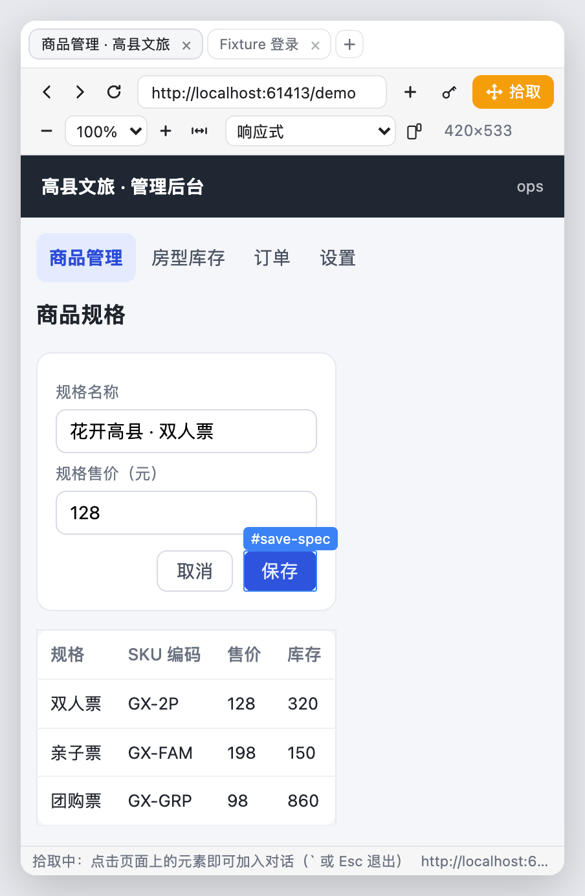
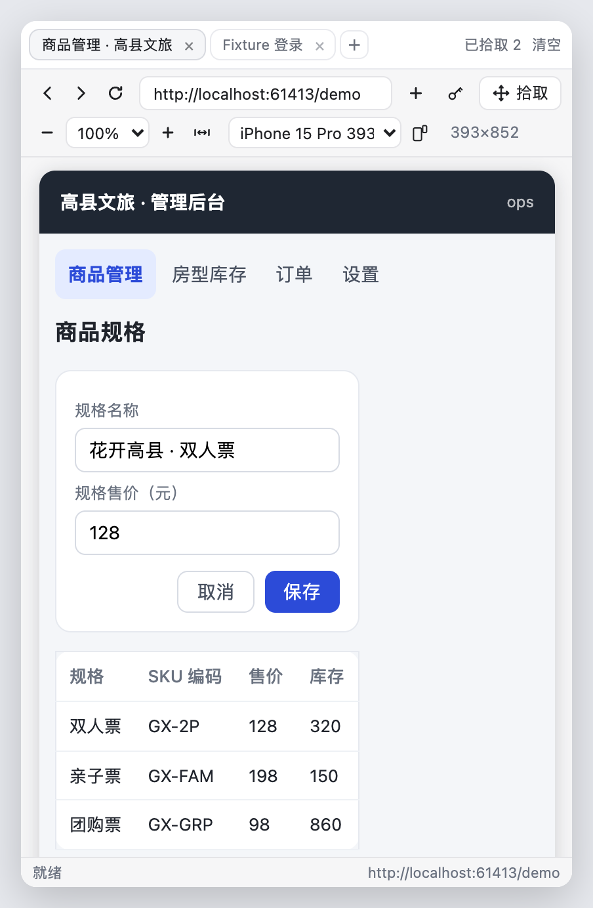

# dsh-sidebar-element-picker

DSH（DeepSeek Harness）动态插件：**把元素拾取放进右侧栏**。在侧边栏里直接浏览网页（多标签页、可缩放、可切手机/平板视口），点「拾取」再点页面上的任意元素，元素就以 `[标签][DOMn]` 引用式占位符进入输入框，完整信息由模型按需通过 `read_picked_element` 工具读取。

不再需要一个额外的 Chrome 窗口，页面也不会一转身就丢。

 

```
┌─ 右侧栏 ───────────────────────────────────────────┐
│ 高县文旅 × │ localhost:3000/admin × │ ＋      已拾取 3 │
├────────────────────────────────────────────────────┤
│ ← → ⟳ [ localhost:3000/admin        ] ＋  ✛拾取    │
│ − 100% + ⤢   [ 响应式 ▾ ]  ↻   393×852            │
├────────────────────────────────────────────────────┤
│   ← 目标站点渲染在同一个代理源里                     │
│      悬浮高亮 → 点击 → 变成 [标签][DOM1]            │
└────────────────────────────────────────────────────┘
```

## 为什么这样设计

要在页面里拾取元素，必须能读到那个页面的 DOM；而浏览器不允许跨源读取 iframe。所以本插件在 loopback 上为每个「对话 + 目标源」开一个**反向代理端口**，把这个端口当成目标站点的「同源替身」：

- 侧边栏里的「浏览器外壳」页面（工具栏 + 高亮框 + 拾取逻辑）和被测页面**同源**，因此能直接读 `contentDocument`、悬浮高亮、点击拦截、快照元素；
- 这个源和 DSH GUI 的源**不同源**，所以被测页面碰不到 GUI 的 DOM，也无法用 `window.top` 导航走 GUI（外层 iframe 也不给 `allow-top-navigation`）；
- 代理把整个源映射到目标站点的根，**不需要改写任何 URL**：`/admin/x?y=1` 上游就是 `/admin/x?y=1`，用 `location.origin` 拼绝对地址的应用照常工作；
- `Upgrade` 连接原样隧道转发，所以 Vite / Next 的热更新 WebSocket 也能用；
- 代理会摘掉 `X-Frame-Options` / `Content-Security-Policy`（否则被测页面拒绝被框）、去掉 `Set-Cookie` 的 `Domain`、把指向目标源的绝对 `Location` 改回本端口——只改这些，响应体一律流式透传。

同一个源上的多个标签页共用一个端口（像同一个浏览器 profile），不同源各自一个端口，**cookie 与 localStorage 不会在站点之间串**。

## 特性

- **多标签页**：面板顶部的标签条，`＋` 新建、`×` 或中键关闭，标签标题跟随页面标题；工具栏的 `＋` 把当前地址新开一个标签页；页面里的 `target="_blank"`、`window.open`、外链点击都会变成新标签页而不是逃出代理
- **页面不会丢**：
  - 标签列表由 **host 持有**（面板只是视图），所以切会话、折叠/展开侧边栏、面板被 DSH 卸载重建，页面都还在；
  - **所有标签页的 iframe 始终挂载**，切标签只是换可见性，不重新加载；
  - iframe 的地址**被钉在产生它的那次导航上**，因此「拾取一次」「标题变了」「计数变了」这类重渲染都不会重载页面（旧版的页面丢失就是这个：一次拾取的重渲染会把 iframe 的 `src` 按宿主持有的当前地址重算，等于刷新）；
  - 标签、地址、缩放、设备预览同时镜像到 localStorage，**DSH 重启后自动还原**（页面本身会重新加载，这是进程重启的物理限制）。
- **页面缩放**：`− / 100% / +`、适应宽度，25%–300%。用的是「按 `宽度/缩放` 布局再整体 transform 缩放」，所以页面的媒体查询按缩放后的宽度生效，和真实浏览器缩放一致，而不是把页面拉伸模糊。
- **手机 / 平板视口预览**：响应式 / Galaxy S23 / iPhone SE / iPhone 15 Pro / iPhone 15 Pro Max / Pixel 8 / iPad mini / iPad Air / iPad Pro 11"，可横竖屏切换，并显示当前视口尺寸。页面拿到的是**真实的窄视口**，`@media (max-width: …)` 会真的命中。
- **原生侧边栏页签**：注册为 DSH 右侧栏的 `browser` 页签类型（`ctx.sidebarRightTabs` + `sidebar.right.pane.tab`），与文件/终端/Git 等页签并列，无第三方依赖；页签标题显示当前页面标题。
- **输入框入口**：工具行十字图标，浏览器为空时打开记忆中的地址，否则只把面板唤到前面——**绝不会把你正在编辑的页面导航走**。
- **打开即用，没有多余的启动页**：面板打开时如果还没有页面，会**直接打开你上次的地址**（重启 DSH 后也一样）。只有从没用过、或你把所有标签页都关掉时，才会看到启动页——它是一个真正的启动台：网址输入、**最近访问**（标题 + 地址，可单条删除或清空）、以及**已保存的账号密码**列表。
- **记住账号密码**：登录表单提交后，面板会像浏览器一样问「保存 localhost:8081 的账号密码？」；保存后每次打开该站点**自动填入**（账号 + 密码，并触发 `input`/`change`，所以 React/Vue 的受控表单也认）。工具栏的钥匙按钮可手动保存（适合 SPA 里不是 `<form>` 的登录），启动页里可以随时点 `×` 忘掉某个站点。
- **站点在重启后仍是同一个浏览器源**：每个目标源会记住上次用的端口并在下次重启时**优先复用**（被占用就自动退回随机端口）。所以应用自己存在 `localStorage` / `IndexedDB` 里的登录态不会因为端口变了而失效——**这通常才是「每次都要重新登录」的真正原因**。
- **`[标签][DOMn]` 引用式占位符**：点击元素后立刻插入输入框（页面内 toast + 面板计数确认）；重复送达的同一次拾取只插入一次。
- **完整元素信息**：HTML、CSS 选择器、DOM 路径、全部属性、视口/文档坐标、尺寸、关键计算样式、页面 URL 与标题，以及拾取时的视口尺寸（方便判断是在手机还是桌面视口下取的）。
- **地址栏容错**：`localhost:3000/admin` 这类不带协议的写法会被正确当成主机与端口，而不是被误判成 `localhost` 协议（`mailto:` / `file:` 之类才会被拒绝）。
- **选择器生成**：优先唯一 `#id`，否则向上最多 6 层，用 `:nth-of-type`（按同标签兄弟计算，修掉了旧版用 `:nth-child` 在混合标签父节点下算错的 bug）。
- **不注入被测页面**：高亮框画在外壳里，被测 DOM 一个节点都不加。
- **暂停/恢复**：工具栏「拾取」按钮或页面内 `` ` `` 键，`Esc` 退出；退出后页面立刻恢复可交互。
- **按需启停**：端口在被打开时才分配，插件加载本身不开任何端口。

## 安装

已经装到 `web` profile 上。重新安装或换机器：

```sh
node tools/install-into-profile.mjs --dry-run   # 先看要改什么
node tools/install-into-profile.mjs             # 软链 + 依赖 + bundle 挂载
```

脚本做三件事（幂等）：

1. 把包软链到 `$DSH_HOME/profiles/web/node_modules/dsh-sidebar-element-picker`；
2. 在 profile 的 `package.json` 里登记依赖（`link:` 指向本目录），并加入 `dsh.profile.bundles`；
3. 如果 profile 里还装着旧的窗口版拾取器，把它的 loader 条目置为 `disabled: true`（两者注册同名的 `read_picked_element`，不能并存）。

**为什么用 bundle 挂载而不是往 `cordis.patch.yml` 手写一行**：手写行也能加载，但 loader 把 profile 自己的 patch 当作**增量**应用，同一个 `insert` 行被重复应用时会留下陈旧条目并报 `duplicate loader entry id`；bundle 层每次重载都是从零重建的，所以是稳定的那种。代价是 bundle 属于**启动期配置**：

```sh
# 装完 / 改完 host 半（lib/index.js）后：重启 DSH Desktop
# 只改 client 半（lib/client.js、resources/*）时：硬刷新浏览器即可
```

**为什么不用 `dsh plugin add`**：那会跑 `pnpm install`，把这个 profile 里所有依赖（含 GitHub 与 `.generations` 链接包）重新解析一遍，需要联网且会重写 profile。

### 卸载 / 回退

```sh
node tools/uninstall-from-profile.mjs
```

## 使用

1. 点输入框工具行的十字图标 → 右侧栏打开「浏览器」页签（图标会变亮）；如果还没有页面，它会直接打开你上次的地址。
2. 要换地址就在页面工具栏的地址栏里输入回车（`localhost:3000/admin` 这种不带协议的写法也认）。首次使用（没有任何历史）时，面板会显示一个启动页：输入网址或点「最近访问」。
3. 用 `＋` 开新标签页；`×` 或中键关闭；点标签切换（不重载）。
4. 用 `− / 100% / + / ⤢` 缩放；用设备下拉切到手机/平板视口，`↻` 横竖屏。
5. 点页面工具栏的「拾取」（或在页面里按 `` ` ``），鼠标划过元素出现高亮框与选择器提示。
6. 点击目标元素 → 输入框自动插入 `[提交订单][DOM1]`，面板头部计数 +1。
7. 继续提问（如「把 [提交订单][DOM1] 改成红色」）并发送；模型需要细节时会调用 `read_picked_element`。
8. 登录场景：先按 `` ` `` 退出拾取模式完成登录，再按 `` ` `` 恢复。

输入框插入由 `conversation.input.left` 槽位负责，即使右侧栏被折叠/切走也能插入（拾取事件走模块内总线，面板只负责发）。

### 关于保存的账号密码

- 存在 **DSH GUI 源的 localStorage**（`dsh-sidebar-element-picker:credentials`）里，按目标源一一对应；**不会**发给 host 插件、**不会**进入对话、**不会**出现在拾取结果里（密码输入框的 `value` 在元素记录中被显式抹掉）。
- 没有可用的系统钥匙串，所以是明文存储：能打开这个浏览器 profile / DevTools 的人就能读到。它和你的 DSH 会话本身是同一信任级别。
- 只在**完全相同的目标源**上填充；换站点不会串。每个站点保留一组账号，再次保存同一站点会覆盖（像浏览器的「更新密码」）。
- 被测页面与外壳同源，所以页面自己理论上能读到填进去的值——但它本来就读得到你在它自己表单里输入的东西，没有额外暴露。

## 校验

不需要 DSH、不需要浏览器：

```sh
npm test          # 代理转发 / 能力 cookie / WS 隧道 / host 路由与工具 / client 注册与渲染
```

需要本机 Chromium。装一次驱动即可（或指向本机 Chrome）：

```sh
npm i -D playwright-core
npm run test:browser                    # 真浏览器里跑完整流程
# 或：DSH_TEST_CHROME="/Applications/Google Chrome.app/Contents/MacOS/Google Chrome" npm run test:browser
```

三个需要目标站点的套件**默认起一个自带的 fixture 站点**（`resources/test/fixture.mjs`：绝对路径资源、带 `Domain` 的 cookie、`X-Frame-Options: DENY` + `frame-ancestors 'none'`、同源绝对重定向、一个媒体查询探针），所以 `npm test` 不依赖你本机跑着什么。想打真实站点就把地址作为第一个参数传进去：

```sh
node resources/test/proxy-smoke.mjs http://localhost:3000
node resources/test/host-smoke.mjs  http://localhost:3000
node resources/test/browser-e2e.mjs http://localhost:3000
```

| 套件 | 覆盖 |
|---|---|
| `proxy-smoke.mjs` | 外壳页/CSS/JS、能力 cookie 门禁、目标文档与子资源代理、`frame-ancestors` 摘除、pick 接收 |
| `tunnel-smoke.mjs` | 裸 socket 跑 `Upgrade`：101 握手、`Host` 改写、`Sec-WebSocket-Accept`、双向字节 |
| `host-smoke.mjs` | `/invoke` 全部方法；标签增删改选；同源共端口、异源分端口、关闭后释放端口；`nav` 只在显式导航时递增；快照还原；`read_picked_element`；系统提示清单 |
| `client-smoke.mjs` | 包工厂装载、页签与槽位注册、按钮「空则开、否则只唤出」、**空浏览器自己打开上次地址**、**首次使用才出现启动页**、标签条渲染、**切标签不重载**、**拾取后重渲染不重载**、缩放/设备随 URL 还原、跨窗口消息拒绝、拾取去重并写入草稿 |
| `browser-e2e.mjs` | 上面全部在一个真 Chromium 里跑通：代理渲染 → 手机/平板视口（含页面自己观察到的 `matchMedia`）→ 横竖屏 → 缩放（布局宽度真的变了）→ 同源/异源导航分流 → 新标签页交接 → 在手机视口下高亮与拾取 → **保存的账号密码自动填入** → **提交时向上报告新账号且不阻断应用自身的 submit** → **密码框在元素记录中被抹除** |

`npm run preview:start` 会把面板启动页渲染成一张图（`resources/test/start-page.png`），方便改样式时直接看效果，不用开 DSH。
`npm run screenshots` 生成上架/详情页用的截图（真代理 + 真外壳 + 真浏览器），并更新 `screenshots.json`。

## 目录结构

```
lib/
  index.js                 host 半：每个对话的浏览器状态 / 代理端口 / 上下文 / 工具 / 系统提示 / /invoke
  client.js                client 半：conversation.input.left 按钮 + 原生 browser 页签（标签条 + 每标签一个 iframe）
resources/
  proxy.js                 每个（对话, 目标源）一个 loopback 反向代理（含 Upgrade 隧道）
  chrome.html/.css/.js     浏览器外壳（工具栏 + 缩放 + 设备预览 + 同源拾取逻辑），由代理在自身源上提供
  test/fixture.mjs         测试用的目标站点（故意带各种难缠的响应头 + 一个登录页）
  test/start-page-preview.mjs 把启动页渲染成图片，便于看样式
tools/
  install-into-profile.mjs 幂等安装（bundle 挂载）
  uninstall-from-profile.mjs
resources/test/            五个套件
docs/research/             动手前对 DSH 侧边栏/宿主/旧插件的逐项考证（含代码行号）
backup/                    安装前的 profile 配置备份
```

## 架构

```
DSH client（lib/client.js）
  ├ conversation.input.left 十字按钮 ── 空则开页并唤出面板；订阅总线，把拾取写进草稿
  └ sidebar.right.pane.tab(key=…:browser) 面板
         ├ 标签条：来自 host 的权威状态（标题/激活/关闭/新建）
         └ 每个标签一个 iframe（全部保持挂载，地址在导航时钉住）
                └ http://<gui-host>:<port>/__dsh_picker__/chrome.html?p=…&z=…&d=…&l=…
                       [代理源] 外壳：地址栏 / 前进后退 / 拾取 / 缩放 / 设备视口 / 高亮 / 元素快照
                           └ <iframe id="site" src="/…">  被测页面（与外壳同源）
                       → POST /__dsh_picker__/pick

DSH host（lib/index.js）
  ├ 每个对话一份浏览器状态：{ tabs[], activeId }（面板可被卸载，状态不会丢）
  ├ 每个（对话, 目标源）一个 ProxySession（127.0.0.1:随机端口）
  │      GET  /*                       反向代理（透传 body，仅改框架相关头）
  │      POST /__dsh_picker__/pick     接收拾取 → 记入该对话上下文
  │      upgrade /*                    原样隧道转发（HMR）
  ├ POST /dsh-sidebar-element-picker/invoke   面板/按钮 → host
  ├ tools.register: read_picked_element
  └ systemPrompt.context: 一元素一行的紧凑清单
```

## 已知限制与信任边界

- **同源是拾取的前提，也是信任边界**：外壳与被测页面同源，所以被测页面理论上能访问外壳页面。它拿不到能力 cookie（`HttpOnly`），但可以伪造一次「拾取」，把内容推进对话上下文——和旧版（任何页面都能 `console.log('__DSH_WE__:'+…)`）是同一类风险。**只浏览你自己信任的页面。**
- 设备预览是**视口预览**：宽度/高度媒体查询、布局、滚动都按设备尺寸生效；但 `devicePixelRatio`、`pointer: coarse`、`hover: none`、User-Agent、触摸事件仍是桌面浏览器的。它不是完整的设备仿真。
- 侧边栏浏览器需要 GUI 跑在 `localhost` / `127.0.0.1` 上（DSH Desktop 默认如此）；从别的机器打开 GUI 时，面板拿不到本机端口。
- 代理会摘掉被测页面的 CSP 与 `X-Frame-Options`。这正是原本无法被框的站点现在能被框的原因，也意味着**页面的安全策略在侧边栏里不生效**。
- DSH 重启后页面会重新加载（地址、标签、缩放、设备预览会还原）；重启前没有提交的表单内容不会保留。
- 一个对话里的 `browser` 页签按 kind 唯一（DSH 页签模型如此），所以浏览器面板同时只有一个，标签页在面板内部。
- 元素按「光标下最内层元素」命中，高亮会先告诉你要选中的是哪一层；嵌套 iframe 内部的元素暂不支持。
- 改动生效范围：**client 半（`lib/client.js`）改完硬刷新即可**（DSH 每 500ms 轮询 client bundle，自动换 revision）；**`resources/`（外壳页面）改完在下一个新开的代理端口生效**（新标签页或换源即可）；**host 半（`lib/index.js`）改动需要重启 DSH Desktop**。

## 发布 / 上架

想让它在 [dsh-market](https://github.com/dsh-market/dsh-market) 里出现，投稿目标是精选列表
[awesome-dsh-plugin](https://github.com/awesome-dsh-plugin/awesome-dsh-plugin)：往 `data/plugins/` 加一个
YAML 文件，市场和目录站会在一天内自动收录。完整步骤、可直接提交的条目内容、以及会被逐条核对的描述写作说明见
[`PUBLISHING.md`](PUBLISHING.md)，条目文件在 `submission/`。

## License

MIT
